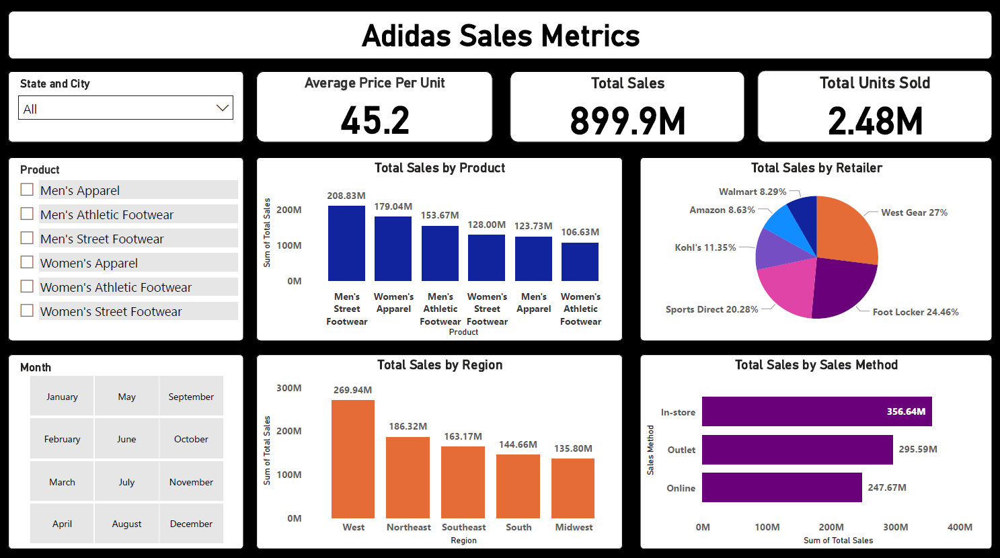
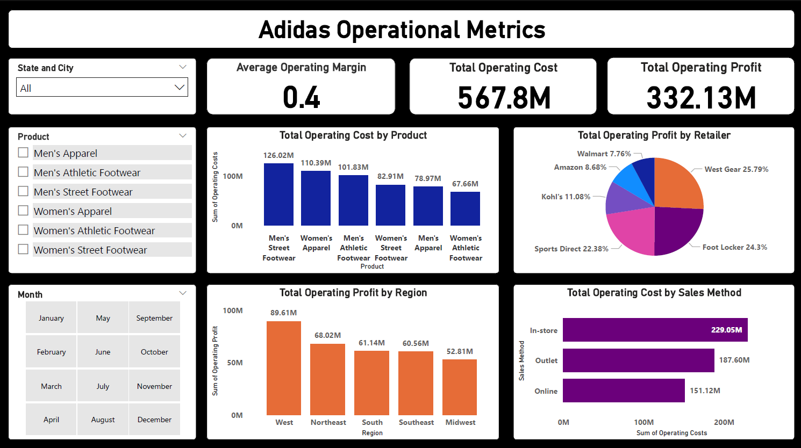
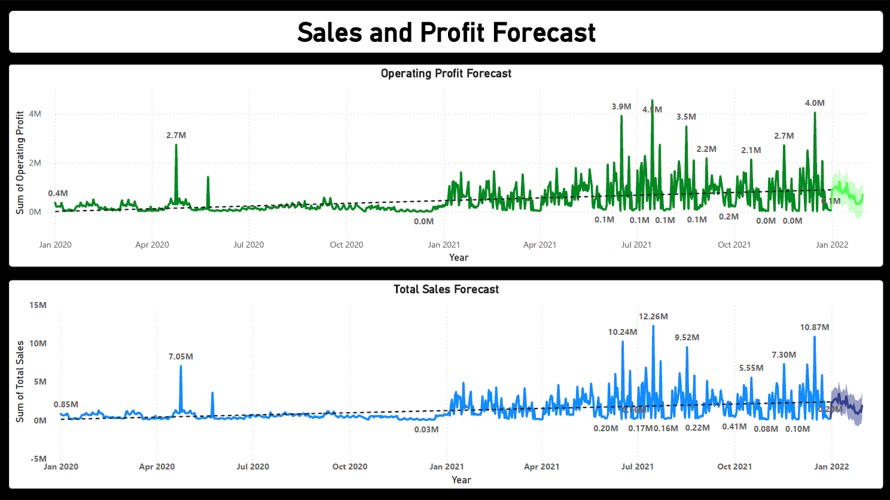

# Adidas Sales Analysis - Power BI Project

## Project Overview

This Power BI project analyzes Adidas sales data across different regions, retailers, and product categories in the United States. The dashboard provides comprehensive insights into sales performance, profitability metrics, and future forecasts to support data-driven decision-making and business strategy optimization.

## Dashboard 1: Adidas Sales Metrics

This dashboard provides a detailed overview of Adidas' sales performance, including key metrics such as total sales of **$899.9M**, an **average price per unit of $45.2**, and **2.48M units sold**. The sales distribution across regions highlights that the **West region leads with $269.94M in sales**, followed by the **Northeast at $186.32M**. The analysis also reveals that **Men's Street Footwear is the top-selling product category with $208.83M in total sales**, while **Women's Athletic Footwear has the lowest sales at $106.63M**. Users can interactively filter the data by region, product category, sales method, and time period to gain deeper insights.

## Dashboard 2: Adidas Operational Metrics

This dashboard focuses on the operational efficiency of Adidas, tracking total operating costs and profitability. Adidas incurs an operating cost of **$567.8M**, yielding an **operating profit of $332.13M** with an **average operating margin of 40%**. Among the regions, the **West contributes the highest operating profit at $89.61M**, while the **Midwest reports the lowest at $52.81M**. The cost distribution shows that **In-store sales drive the highest operating costs at $229.05M**, followed by **Outlet sales at $187.60M**. The dashboard enables users to explore cost and profit trends across different sales channels and product categories.

## Dashboard 3: Sales and Profit Forecast

This dashboard provides predictive analytics for Adidas' future sales and operating profits. The sales forecast indicates fluctuations over time, with peak sales reaching **$12.26M** in **July 2020** and the lowest at **$0.03M in January 2021**. The operating profit forecast follows a similar trend, with the highest projection of **$4.5M**. These insights assist in strategic planning, helping Adidas optimize inventory and allocate resources effectively.

## Technologies Used

-   **Power BI** for data visualization
-   **Python** for data cleaning and transformation
-   **Excel / CSV** for raw data storage
-   **DAX & Power Query** for data modeling and transformation

## Future Enhancements

-   Forecasting future sales trends using predictive analytics.
-   Adding more granular insights such as retailer-specific performance.
-   Enhancing interactivity with additional drill-down features.

For more information or to view the dataset, visit the [Kaggle dataset page](https://www.kaggle.com/datasets/heemalichaudhari/adidas-sales-dataset).
